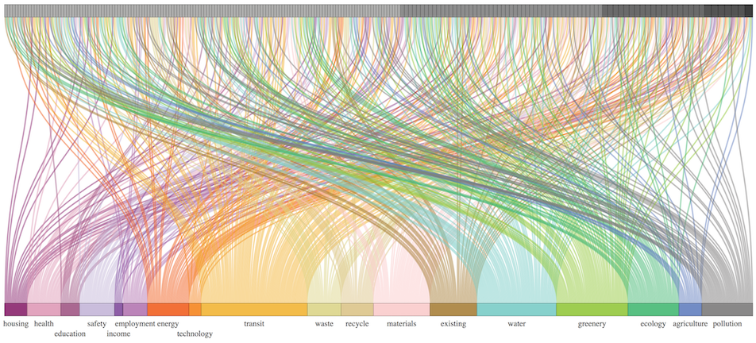
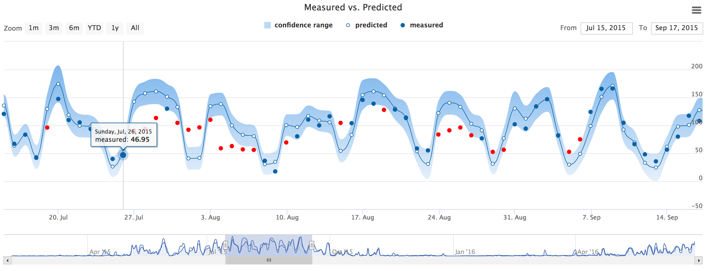
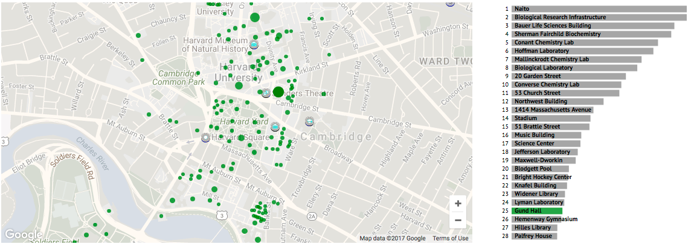

# cluster-analysis-model-
##分布式综合智慧能源系统模型——能源消费聚类分析模型
=========================== 
### 项目简述
为有效推动能源清洁生产和就近消纳,提高整个区域能源系统的能源利用率、经济性与稳定性,达到节能环保的目的,我们应用了五个机器学习模型（高斯过程回归，线性回归，K最近邻，随机森林和支持向量回归）来预测校园建筑的能耗。

通过这些机器学习模型可以得出准确的能耗预测。设施管理，公用事业公司和建筑调试项目可以利用它们来实施节能政策。如果大学设施能预测所有校园建筑物的能耗，则可以提前制定计划以优化冷却器，锅炉和储能系统的运行。在数据预测与处理的同时完成数据可视化。

### 预测模型
我们收集了一栋建筑物的数据，并将其分为训练集和测试集。对于每个机器学习模型，我们使用训练集训练模型以预测能耗，并使用测试集验证预测模型。

一旦我们使用一栋建筑物的数据找出最有效的机器学习模型，最有影响力的功能，最合适的参数，那么经过训练的模型就可以用于预测另一座相似类型的建筑物的能耗：相似的HVAC系统，相似的房间空间，房间类型（办公室或实验室）。
### Gaussian Process Forecasting网页工具
高斯过程（GP）回归是一种机器学习技术，可基于一组历史数据进行预测。有许多其他类型的机器学习技术可以达到相同的目的,但是GP回归有更多优势。比如，它将建模不确定性考虑在内并输出预测分布。以此更仔细地检查回归的准确性。也可以使用GP回归来评估某些变量对输出的影响。这些应用包括但不限于预测建筑能耗，能源需求，公用事业发电。

该工具利用GP回归进行预测。它由五个页面组成，每个页面具有不同的功能。

在上传页面上，用户可以csv格式上传数据。具体格式要求如下。每条数据中必须包含一个名为“时间戳”的条目。其他列应包括功能和目标。尽管用户可以在“配置”页面上更改目标，但是默认目标是csv文件的最后一列。示例如下： 
timestamp     t     w      lighting        sat1        sat2       sat3        rat1        rat2       rat3     total electricity 
102291100000 19.4 0.00809 0.325502921  11.01650989 12.80060104 12.80000743 24.96274931 25.02027012 23.5406751   128.0429675

### 数据可视化效果展示

- **桑基图（Sankey diagram）**

- **具有置信范围的时间序列图**

- **校园能源可视化**

王波波，宋伟，李天昊，汤俊萱，孙奕程

东华大学，上海视易信息技术有限公司，2020
